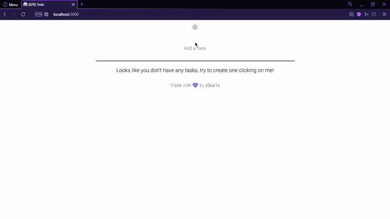

  
❓ What is this?
- A simple todo list.

  
⚙️ Used technologies:
- NodeJS.
- ReactJS.

  
📌 Features:
- Check/uncheck any task
- Remove any task
- Not responsive yet (Soon)
- Auto-save (Using LocalStorage)

  
🔧 Setup:
- Clone this repository: 
`git clone https://github.com/z3ox1s/todo-list` or Download ZIP and unzip;  
- Move to repository: 
`cd todo-list`  
- Install all NodeJS dependencies: 
`npm install` or `yarn install`  
- Build: 
`yarn winbuild` (Windows) or `yarn build` (Any other OS)  
- Run: 
`npm start` or `yarn start` (Development) 
`npm production` or `yarn production` (Production)  

📖 Dependencies:
- <a href="https://nodejs.org">NodeJS</a>
